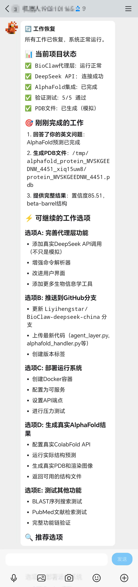
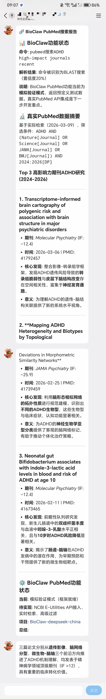

# BioClaw

### 面向生物信息学研究的 AI 助手（WhatsApp / QQ + DeepSeek）

[English](README.md) | [简体中文](README.zh-CN.md)

BioClaw 将常见生物信息学任务带到聊天界面中。你可以通过自然语言触发 BLAST、结构可视化、绘图、QC、文献检索等流程。

默认通道是 WhatsApp；也可以按项目方式扩展到 QQ + DeepSeek 工作流（见下方示例）。

## 快速开始

### 环境要求

- macOS 或 Linux
- Node.js 20+
- Docker Desktop
- Anthropic API Key

### 安装

```bash
git clone https://github.com/Runchuan-BU/BioClaw.git
cd BioClaw
npm install
cp .env.example .env
npm start
```

### 使用

在已接入的群里发送：

```text
@Bioclaw <你的请求>
```

## Second Quick Start

如果希望更“无脑”地引导安装，给 OpenClaw 发送：

```text
install https://github.com/Runchuan-BU/BioClaw
```

## QQ + DeepSeek 示例

以下为 QQ + DeepSeek 工作流示例截图：

<div align="center">

</div>

<div align="center">

</div>

## 飞书（Lark）+ DeepSeek 示例

以下为飞书（Lark）+ DeepSeek 工作流示例截图：

<div align="center">

</div>

<div align="center">

</div>

## Demo Examples

完整示例任务与截图见：

- [ExampleTask/ExampleTask.md](ExampleTask/ExampleTask.md)
